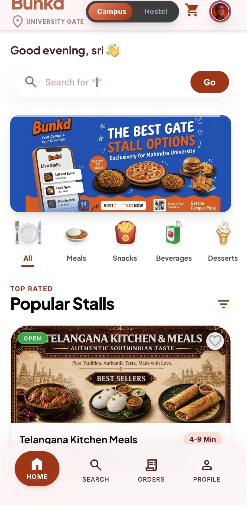
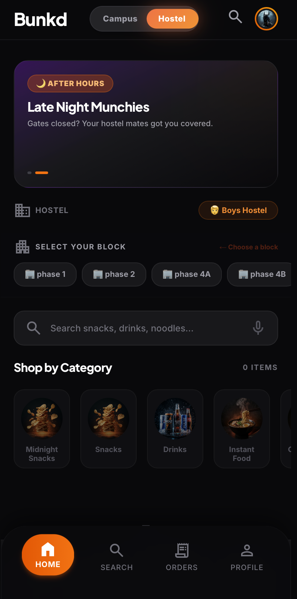
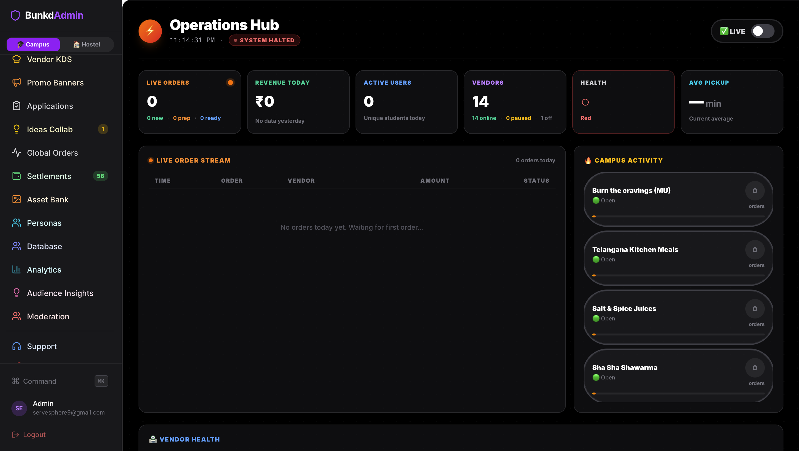
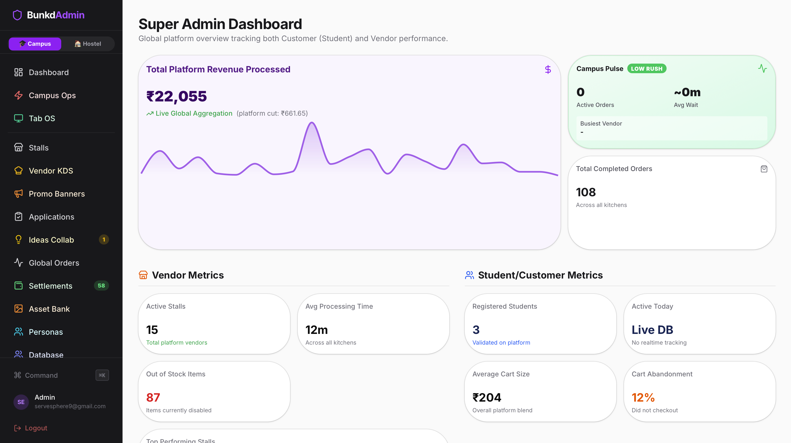

# Bunkd

Bunkd is a campus commerce platform designed to simplify food discovery, ordering, and student commerce inside university campuses.

## Overview

Bunkd helps students:

- Discover nearby food stalls
- Browse menus
- Place pickup orders
- Explore hostel marketplace offerings
- Access a seamless campus commerce experience

## Features

### Campus Mode
Food ordering and stall discovery around campus.

### Hostel Mode
Student-to-student snack and essentials marketplace.

### Operations Hub
Real-time monitoring of orders, vendors, and platform activity.

### Audience Intelligence
Student engagement, behavior insights, and analytics dashboards.

## Tech Stack

- Next.js
- React
- TypeScript
- Tailwind CSS
- Supabase
- Vercel

## Screenshots

Project screenshots are available in the screenshots folder.

## Role

Frontend UI/UX development, dashboard interfaces, responsive layouts, analytics visualizations, and platform design systems.

## Screenshots

### Campus Mode

### Hostel Mode

### Operations Hub

### analytics

